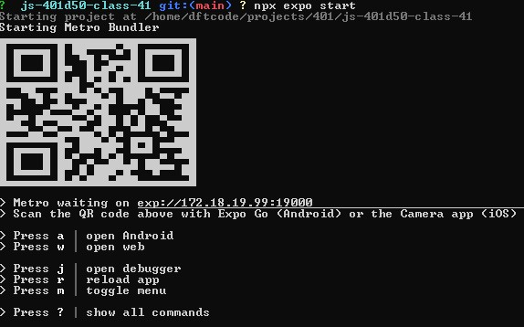
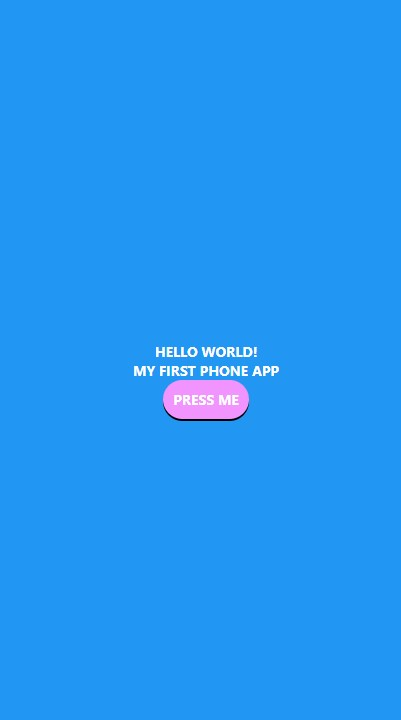
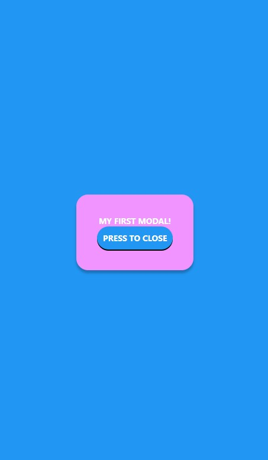
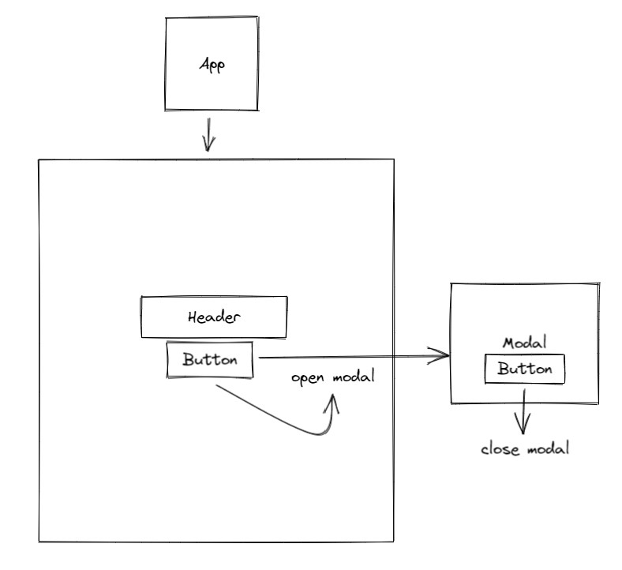
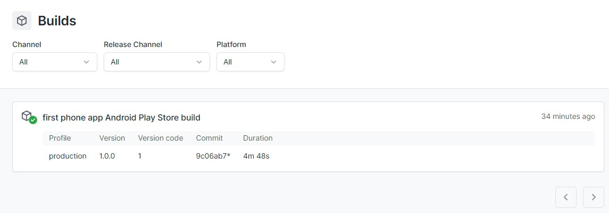
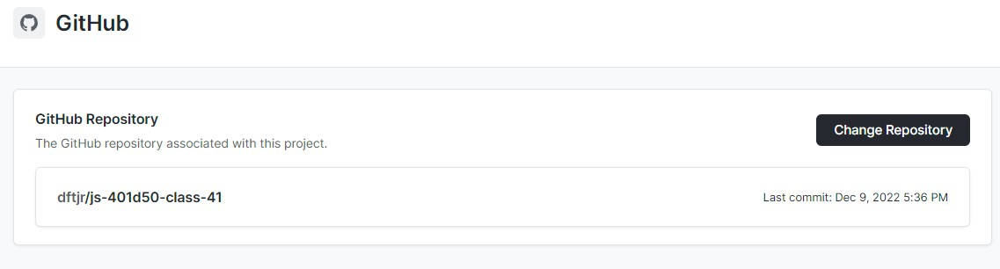

# LAB - 41

## Milestone 1 - MVP

## Author

David Tusia

## Setup

- In the terminal type <code>npx expo start</code>

## Running the app

- Click one of the prompts for how you want to view the app

## Testing

- Click the button to show a modal

- Click the button to close the modal

## UML

# LAB - 42

## Milestone 2 - Product Delivery (This Lab)

## Author

David Tusia

## Setup

- In the terminal type <code>npx expo start</code>

## Running the app

- Click one of the prompts for how you want to view the app

## Accounts

## Testing

- Click the button to show a modal

- Click the button to close the modal

## UML

